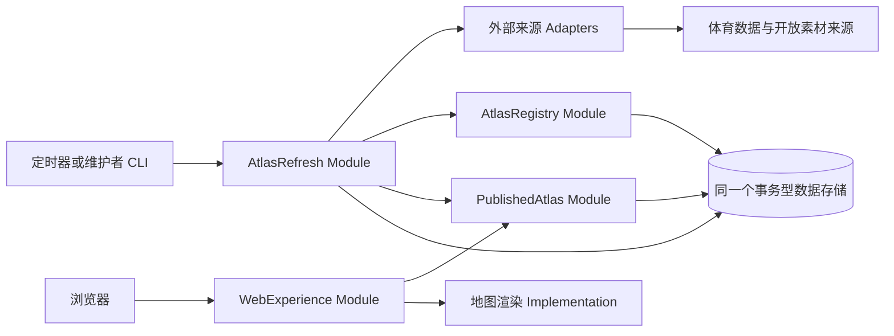
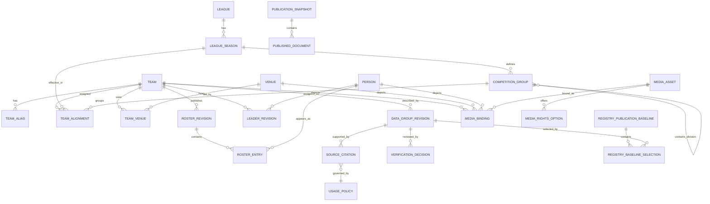
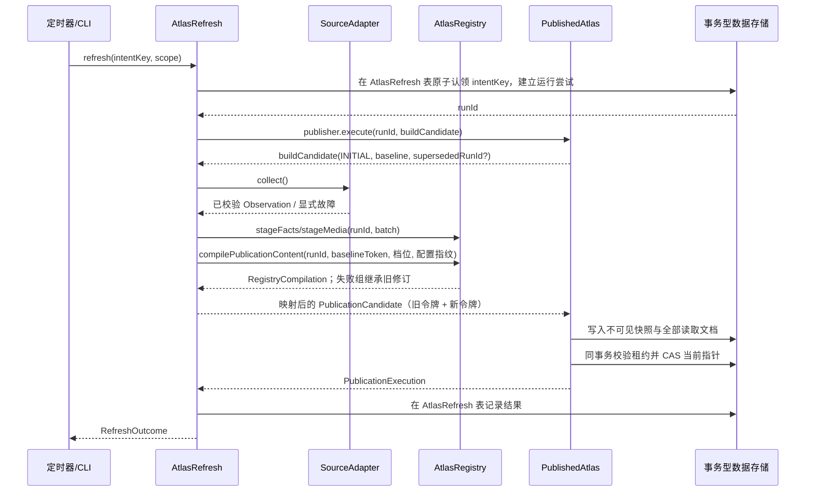

# 职业体育地图：模块化单体架构

本文依据根目录 `CONTEXT.md` 与 `docs/adr/0001`—`0008` 设计。它描述第一版的逻辑架构和模块 Interface，不选择 Web 框架、数据库产品、地图供应商、托管平台或最终体育数据源。

## 1. 架构结论

项目采用**模块化单体**：

- 一个代码库、一个版本、一个可部署应用和一个事务型数据存储。
- 同一应用提供 `web`、`refresh` 和 `migrate` 三个运行入口；定时刷新可以作为单独进程启动，但使用同一构建产物、同一 Module 和同一数据库，不是微服务。
- Module 之间只通过进程内 Interface 通信，不通过内部 HTTP、消息中间件或共享脚本通信。
- 对外读取只访问已经发布的不可变快照，不直接读取正在同步的工作数据，也不在用户请求中调用体育数据源。
- 第一版没有账户、管理后台、站内纠错写入接口、公共 API、消息队列、Redis、独立搜索集群或分布式事务。

推荐的四个顶层 Module：

1. `AtlasRegistry`：维护规范化体育事实、稳定身份、来源与许可规则。
2. `AtlasRefresh`：从外部来源采集、校验、协调和刷新资料。
3. `PublishedAtlas`：编译、原子发布并读取页面、地图和搜索快照。
4. `WebExperience`：把稳定路由和浏览器交互映射到 `PublishedAtlas`，不拥有体育事实。

## 2. 设计约束与容量假设

### 2.1 必须满足的产品约束

- 覆盖 NBA、NFL、MLB、NHL 的全部当前成员球队，包括加拿大球队。
- 地图使用当前主要主场坐标；共用场馆只有一个地点，但可以关联多支球队。
- 联盟赛区遵循当前赛季官方结构：一级分组，最多再到一层 Division。
- 球队页展示主要主场、负责人和当前阵容，但没有球员页、负责人页、赛程、比分、排名或比赛统计。
- 身份、场馆、负责人和阵容分别记录来源、同步时间与核验状态；图片逐张记录许可。
- 同步失败时保留最后成功资料；缺失、过期和来源冲突必须是显式状态。
- 只有许可明确允许的素材才能显示；Logo 不可用时显示缩写，其他图片不可用时显示占位图。
- 地图、球队页、联盟页和联盟赛区页可分享；球队旧 slug 永久跳转到当前标准网址。
- 产品为英文响应式网站，地图有 List 替代视图；无账户、无行为分析、无 PWA 和离线承诺。

### 2.2 架构容量假设

这些是设计上限，不是访问量承诺或市场目标：

| 项目 | 第一版设计量级 |
|---|---:|
| 当前球队 | 不超过 200 |
| 当前阵容条目 | 不超过 20,000 |
| 场馆、联盟赛区与搜索实体 | 不超过 2,000 |
| 同步频率 | 每日一次尽力执行，允许手动重跑 |
| 读写比例 | 读取远高于写入 |
| 页面一致性 | 单次响应全部来自同一发布快照 |
| 可用性 | 尽力而为，不承诺商业 SLA |

这个量级适合在同步后重新编译完整读取快照。第一版不需要按微服务或大数据系统设计。

## 3. 候选方案比较

这里用 `Depth` 表示一个简洁 Interface 隐藏了多少复杂 Implementation，用 `Locality` 表示一次领域变化能否集中在少量相邻代码中；两者用于比较边界质量，而不是追求 Module 数量。

| 方案 | Interface 深度 | 修改局部性 | 优点 | 主要问题 |
|---|---|---|---|---|
| A：单一 `SportsAtlas` 深 Module | 最高 | 所有规则集中 | 最少概念、最适合单人维护 | 容易演变成内部无结构的大模块 |
| B：目录、场馆、阵容、来源、素材、投影分别成 Module，并用事务事件连接 | 中等 | 单个领域变化最集中 | 新联盟、新来源和新投影扩展性最好 | Module、表、事件和测试数量对爱好项目过重 |
| C：面向页面的编译式快照 | 读取侧很高 | 页面与同步分离 | SSR、地图和搜索读取最简单，故障隔离最好 | 页面投影可能与 UI 过度耦合 |

最终采用混合方案：保留 A 的小 Interface、C 的不可变快照，并只采用 B 中已经存在多个实现的真实 Seam——四联盟规则和多个外部数据源。第一版不使用事务事件日志；数据规模扩大后仍可在单体内部增加。

## 4. 总体结构



外部地图只负责绘制底图和标记。经纬度、球队、场馆、赛区和卡片内容全部来自本应用；地图 SDK 的类型不得进入领域 Interface。供应商尚未选择，因此当前把地图称为 `WebExperience` 内部 Implementation；出现生产实现与可替代测试实现后，才正式建立 `MapRenderer` Seam。

### 4.1 运行入口

```text
application web       # HTTP、SSR、地图客户端资源
application refresh   # 每日同步、手动刷新或只重建快照
application migrate   # 一次性执行全部 Module 的数据库迁移
```

三个入口在同一个 composition root 中装配完全相同的 Module 与 Adapter。它们一起发布和回滚，不允许形成各自独立版本。

## 5. Module 与数据所有权

| Module | 拥有的数据 | 隐藏的 Implementation | 禁止事项 |
|---|---|---|---|
| `AtlasRegistry` | 联盟、赛季、官方赛区、球队稳定身份、历史别名、slug 历史、场馆、主要主场、阵容、负责人、数据组修订、来源证据、核验与冲突、素材许可元数据，以及由不透明令牌标识的发布基线选择 | 四联盟术语差异、球队连续性、赛区生效、名单状态、来源优先级、双来源核验、图片回退规则 | 不提供逐表 CRUD；不返回外部来源原始结构；不读取发布表 |
| `AtlasRefresh` | 同步意图与运行尝试、来源游标、外部 ID 映射、拒绝记录和允许保留的响应摘要 | 认证、分页、限流、退避、Schema 校验、规范化、部分失败、模块 DTO 映射和刷新编排 | 不决定页面布局；不直接写 Registry 或发布表 |
| `PublishedAtlas` | 不可变发布快照、页面文档、地图文档、搜索文档、旧 slug 重定向投影、带租约的全局发布会话、已清理快照墓碑、发布 Schema 门和当前快照指针 | 页面组合、稳定排序、SEO 元数据、缓存键、候选验证和原子切换 | 不访问外部数据源；不读取 Registry 表；不让 Web 跨表拼页面 |
| `WebExperience` | 无规范业务数据；仅有静态界面资源 | HTTP 输入校验、SSR、状态码、Map/List 切换、语义地图状态、分享与 GitHub Issue 链接、响应式和无障碍交互 | 不直接访问数据库；不复制联盟或许可规则；不提供写入 HTTP 接口或本地个性化档案 |

### 5.1 依赖规则

允许的顶层依赖只有：

```text
WebExperience  ──> PublishedAtlas
AtlasRefresh   ──> AtlasRegistry
AtlasRefresh   ──> PublishedAtlas
```

- 每个 Module 只允许通过自己的公开 `index` 导入；禁止跨 Module 导入 `internal`、数据库模型或迁移。
- 数据库表使用 schema 或表名前缀标记所有权，只有所属 Module 可以写入。
- 跨 Module 只传 branded ID、不可变值对象和明确的批次结果，不传 ORM 实体或数据库事务对象。
- composition root 是唯一知道具体 Adapter、配置和启动顺序的位置。
- `shared` 只能放 `Clock`、`Result`、日志上下文和 branded ID 等稳定原语；禁止建立共享 `Team`、共享 Repository 或万能工具层。
- 数据库外键只可引用稳定身份，并不授权另一个 Module 直接修改该表。

## 6. 关键 Interface

以下 TypeScript 只表达契约，不预先选择实现语言或框架。

### 6.1 共同结果与资料状态

```ts
type LeagueCode = "NBA" | "NFL" | "MLB" | "NHL";
type DataGroupKind = "IDENTITY" | "VENUE" | "LEADER" | "ROSTER";
type SnapshotId = string & { readonly __brand: "SnapshotId" };
type RefreshRunId = string & { readonly __brand: "RefreshRunId" };
type TeamId = string & { readonly __brand: "TeamId" };
type Instant = string; // ISO-8601

type Result<T, E> =
  | { ok: true; value: T }
  | { ok: false; error: E };

type NonConflictVerification =
  | { kind: "UNVERIFIED" }
  | { kind: "VERIFIED"; verifiedAt: Instant; rule: "OFFICIAL" | "TWO_SOURCES" };

type PublishedDataGroup<T> =
  | {
      kind: "CURRENT";
      value: T;
      syncedAt: Instant;
      verification: NonConflictVerification;
      sources: readonly SourceCitation[];
    }
  | {
      kind: "RETAINED_AFTER_FAILURE";
      value: T;
      lastSuccessfulSyncAt: Instant;
      failedAt: Instant;
      isPossiblyStale: boolean;
      verification: NonConflictVerification;
      sources: readonly SourceCitation[];
    }
  | {
      kind: "CONFLICT";
      detectedAt: Instant;
      lastVerifiedValue?: T;
      lastVerifiedAt?: Instant;
      sources: readonly SourceCitation[];
    }
  | {
      kind: "UNAVAILABLE";
      reason: "NEVER_SYNCED" | "MISSING";
      sources: readonly SourceCitation[];
    };

type RightsBasis =
  | {
      kind: "OPEN_LICENSE";
      author: string;
      sourceUrl: string;
      licenseName: string;
      licenseVersion?: string;
      licenseUrl: string;
      retrievedAt: Instant;
    }
  | {
      kind: "PUBLIC_DOMAIN";
      author?: string;
      sourceUrl: string;
      basis: string;
      retrievedAt: Instant;
    };

type TeamVisual =
  | { kind: "REUSABLE_MEDIA"; src: string; alt: string; rights: RightsBasis }
  | { kind: "ABBREVIATION"; text: string; alt: string };

type Photo =
  | { kind: "REUSABLE_MEDIA"; src: string; alt: string; rights: RightsBasis }
  | { kind: "PLACEHOLDER"; alt: string };
```

页面不允许通过 `null` 猜测资料是缺失、过期或冲突。单一判别联合排除了 `CONFLICT + VERIFIED`、`UNAVAILABLE + VERIFIED` 等非法组合。媒体与事实状态分离；一个素材可以保存多个权利选项，但发布时必须由 Registry 的权利策略选择一个明确的 `RightsBasis`，或使用缩写/占位图。

### 6.2 `AtlasRegistry` Interface

```ts
type FactBatch =
  | TeamIdentityBatch
  | VenueBatch
  | LeaderBatch
  | RosterBatch;

interface AtlasRegistry {
  stageFacts(
    input: { runId: RefreshRunId; batch: FactBatch }
  ): Promise<Result<ReconcileReceipt, RegistryFault>>;

  stageMedia(
    input: { runId: RefreshRunId; batch: MediaAssetBatch }
  ): Promise<Result<ReconcileReceipt, RegistryFault>>;

  abandonRun(runId: RefreshRunId): Promise<Result<void, RegistryFault>>;

  compilePublicationContent(
    request: {
      runId: RefreshRunId;
      baselineToken: string | null;
      profile: "PREVIEW" | "V1";
      configurationFingerprint: string;
      requestedAt: Instant;
    }
  ): Promise<Result<RegistryCompilation, RegistryFault>>;
}

interface RegistryCompilation {
  runId: RefreshRunId;
  baselineTokenUsed: string | null;
  nextBaselineToken: string;
  profile: "PREVIEW" | "V1";
  schemaVersion: number;
  content: CompiledRegistryContent;
}
```

Interface 不变量：

- `FactBatch` 只能包含一个来源、一个来源能力、一个联盟、一个赛季和一个数据组；批次必须带稳定的 `sourceId + capabilityKey`、来源定位、获取时间、内容哈希及是否完整分页。
- `MediaAssetBatch` 以单张来源文件和权利记录为单位，不强制属于单一联盟、赛季或事实数据组。
- 所有暂存修订都绑定 `runId`。第一次 `compilePublicationContent` 会封存该运行，之后的 `stageFacts/stageMedia` 返回 `RUN_SEALED`；已封存运行仍可针对更新后的 `baselineToken` 幂等重编译，但只能读取该运行已完整接收的批次和该令牌在 Registry 内指向的旧修订，不能看到其他运行或半个分页的中间状态。`abandonRun` 是幂等终止操作，之后三种操作都返回 `RUN_ABANDONED`。
- `baselineToken` 是 `AtlasRegistry` 产生并解释的不可猜测、不透明令牌；`PublishedAtlas` 只随快照保存和返还它，不能据此读取 Registry。Registry 对 `(runId, baselineToken, profile, configurationFingerprint)` 建唯一约束：同一编译请求必须重放原 `RegistryCompilation`、原 `nextBaselineToken` 和原内容；只有新的唯一编译键首次执行时才产生新令牌及不可变选择记录。
- 不完整批次不能把未出现的球队或球员解释为删除。
- 相同来源修订或内容哈希重复提交是幂等成功；较旧观察不能覆盖较新资料。
- 当前球队必须恰好属于一个联盟和一个官方一级分组，最多再属于一个 Division。
- 场馆坐标属于场馆；球队的地图位置由当前主要主场推导。
- 阵容保留联盟官方状态名称与顺序，不强行转换成跨联盟统一枚举。
- 冲突未解决时不能产生 `VERIFIED`；同步时间不能充当核验时间。
- 没有完整许可记录的媒体不能被编译为可展示素材。
- `V1` 候选要求每支当前球队至少具有身份、联盟赛区、主要主场与坐标、官方链接和来源；阵容、负责人和媒体可以显式缺失。`PREVIEW` 可以采用较低覆盖门槛，但必须标记为 Preview。
- `compilePublicationContent` 返回 Registry 自己拥有的完整、不可变、与数据库实现无关的 `RegistryCompilation`，不返回 ORM 对象，也不引用 `PublishedAtlas` 的 Interface 类型。`AtlasRefresh` 把它显式映射为 `PublishedAtlas` 所拥有的 `PublicationCandidate`；该映射是两个 Module DTO 之间唯一允许的转换点。

人工核验没有在线写入口。受信任审核者的决定保存在仓库内的受审查清单中，由专用 `RepositoryCurationAdapter` 在 `REBUILD` 或刷新运行中转换成带审核者与证据的 FactBatch；禁止人工直接修改数据库。

### 6.3 联盟规则内部 Seam

`AtlasRegistry` 内部使用一个真实 Seam 隔离四个联盟的差异：

```ts
interface LeaguePolicy {
  readonly league: LeagueCode;
  selectPublishedSeason(input: {
    at: Instant;
    officialSeasonEvidence: readonly OfficialSeasonEvidence[];
  }): Result<LeagueSeason, LeagueRuleFault>;
  validateAlignment(input: AlignmentDraft): Result<Alignment, LeagueRuleFault>;
  rosterPresentation(input: readonly RosterEntry[]): readonly RosterGroup[];
  leaderRole(): "HEAD_COACH" | "MANAGER";
}
```

四个生产 Adapter 与测试 Adapter 证明该 Seam 真实存在。它隐藏赛季命名、Offseason、一级赛区术语、Division、名单状态和负责人称谓；页面不得出现 `if (league === "MLB")` 一类领域判断。赛季选择必须依据已经保存的官方生效证据；只经过一个日历日期不能自动切换到新赛季，新名单正式发布前继续选择最近有效赛季并输出 Offseason。

### 6.4 外部来源 Seam 与 `AtlasRefresh` Interface

```ts
type MediaKind = "LOGO" | "VENUE_PHOTO" | "PLAYER_PHOTO";

type CollectRequest =
  | {
      kind: "FACTS";
      league: LeagueCode;
      season: string;
      groups: readonly DataGroupKind[];
      cursor?: string;
    }
  | { kind: "MEDIA"; mediaKinds: readonly MediaKind[]; cursor?: string };

type ObservationBatch =
  | { kind: "FACTS"; completeScope: boolean; batch: FactBatch; nextCursor?: string }
  | { kind: "MEDIA"; completeScope: boolean; batch: MediaAssetBatch; nextCursor?: string };

interface SourceAdapter {
  readonly manifest: {
    sourceId: string;
    capabilities: readonly (
      | {
          capabilityKey: string;
          kind: "FACTS";
          league: LeagueCode;
          groups: readonly DataGroupKind[];
        }
      | {
          capabilityKey: string;
          kind: "MEDIA";
          mediaKinds: readonly MediaKind[];
        }
    )[];
  };

  collect(request: CollectRequest): AsyncIterable<Result<ObservationBatch, SourceFault>>;
}

interface RefreshIntent {
  intentKey: string;
  trigger: "SCHEDULED" | "MANUAL" | "REBUILD";
  leagues?: readonly LeagueCode[];
  groups?: readonly DataGroupKind[];
  requestedAt: Instant;
}

type RefreshOutcome =
  | {
      kind: "PUBLISHED" | "PUBLISHED_WITH_WARNINGS";
      runId: RefreshRunId;
      snapshotId: SnapshotId;
      updatedGroups: number;
      inheritedGroups: number;
      unavailableGroups: number;
      conflicts: number;
    }
  | { kind: "UNCHANGED"; runId: RefreshRunId; snapshotId: SnapshotId }
  | { kind: "REJECTED"; runId: RefreshRunId; issues: readonly RefreshIssue[] }
  | { kind: "IN_PROGRESS"; retryAfterSeconds: number }
  | { kind: "INTENT_CONFLICT" }
  | { kind: "UNAVAILABLE"; traceId: string };

interface AtlasRefresh {
  refresh(intent: RefreshIntent): Promise<RefreshOutcome>;
}
```

`SourceAdapter` 在边缘把 `unknown` 响应解析为 Observation，隐藏认证、请求协议、分页和来源字段名，但不得决定最终事实、核验状态、删除或使用权。每条 Observation 必须有来源定位信息、幂等依据和稳定的 `sourceId + capabilityKey`。经审核的用途政策由 `AtlasRegistry` 按来源与能力组合持久拥有，并可进一步收窄到数据组或单张素材；Registry 必须验证二者与 Observation 严格匹配，Adapter 不能提交或借用另一来源的政策引用。未知或不匹配的政策默认拒绝网站展示、仓库再分发和未来公共 API 再分发。

`refresh()` 是调度器唯一需要理解的入口。其结果为 `PUBLISHED`、`PUBLISHED_WITH_WARNINGS`、`UNCHANGED`、`REJECTED`、`IN_PROGRESS`、`INTENT_CONFLICT` 或 `UNAVAILABLE`，并报告更新、继承、缺失、冲突和拒绝的数据组数量。

发布档位不是调用参数。composition root 通过部署配置向 `AtlasRefresh` 注入只读的 `publicationProfile: "PREVIEW" | "V1"`；首次认领意图时把实际档位与配置指纹写入运行记录，使同一意图的重放不受后续配置变化影响。普通定时器、CLI 和外部调用者均不能把正式站点临时降级为 Preview。

幂等规则：

- 同一次重试必须复用同一个 `intentKey`。
- 数据库只对逻辑意图的 `intentKey` 建唯一约束，并在首次认领时保存 `requestHash`、实际发布档位和配置指纹；相同 Key 和相同 hash 重放已完成结果或继续该意图，相同 Key 和不同 hash 返回 `INTENT_CONFLICT`。一个逻辑意图可以在崩溃恢复时产生多个运行尝试，但同一时刻至多一个有效尝试。
- 第一版由 `PublishedAtlas.publisher.execute()` 在内部使用一个全局刷新与发布**租约**，避免全量刷新和局部刷新范围重叠；内部租约包含随机令牌、所属 `runId`、到期时间和心跳。调用者只看到一次受管执行，其他并发请求返回 `IN_PROGRESS`。
- 租约到期后，`execute()` 在授予新运行前原子检查旧运行的发布收据：若已经发布，则返回 `RECOVERED`；否则在新运行的首次构建上下文中给出 `supersededRunId`。`AtlasRefresh` 以版本条件把旧尝试标记为 `ABANDONED` 并调用 `AtlasRegistry.abandonRun(oldRunId)`；替代运行不复用旧暂存数据，失去租约的进程不能再通过 Publisher 发布。
- 每次运行从 `PublicationBuildContext.baseline` 取得 `baseSnapshotId + baselineToken`，所有暂存 Observation 都绑定该 `runId`；`AtlasRefresh` 不直接读取当前指针、会话、租约、收据或任何发布表。

### 6.5 `PublishedAtlas` Interface

```ts
type PageRequest =
  | { kind: "HOME" }
  | { kind: "TEAM"; slug: string }
  | { kind: "LEAGUE"; league: LeagueCode }
  | { kind: "LEAGUE_GROUP"; league: LeagueCode; groupSlug: string };

interface PageMetadata {
  snapshotId: SnapshotId;
  canonicalPath: string;
  seo: { title: string; description: string; indexable: boolean };
  generatedAt: Instant;
}

interface TeamPreviewView {
  teamId: TeamId;
  teamName: string;
  teamVisual: TeamVisual;
  decorativeColor?: string;
  venuePhoto: Photo;
  venueName: string;
  regularGameCapacity?: number;
  openedYear?: number;
  venueFactsSourceUrl?: string;
  league: LeagueCode;
  actions: {
    officialWebsiteUrl: string;
    sharePath: string;
    detailsPath: string;
  };
}

interface TeamActionsView {
  officialWebsiteUrl: string;
  sharePath: string;
  reportIssueUrl: string;
  mapFocus: { kind: "TEAM"; teamId: TeamId };
}

type PageDocument =
  | (PageMetadata & { kind: "HOME"; leagueDirectory: readonly LeagueSummary[] })
  | (PageMetadata & {
      kind: "TEAM";
      identity: PublishedDataGroup<TeamIdentityView>;
      actions: TeamActionsView;
      venue: PublishedDataGroup<VenueView>;
      leader: PublishedDataGroup<LeaderView>;
      roster: PublishedDataGroup<RosterView>;
      sameDivisionTeams: readonly TeamSummary[];
      mediaAttributions: readonly MediaAttribution[];
    })
  | (PageMetadata & {
      kind: "LEAGUE";
      league: LeagueView;
      officialGroups: readonly OfficialGroupView[];
      provenance: readonly DataGroupSummary[];
    })
  | (PageMetadata & {
      kind: "LEAGUE_GROUP";
      group: OfficialGroupView;
      divisions: readonly DivisionView[];
      provenance: readonly DataGroupSummary[];
    });

type PageResolution =
  | { kind: "FOUND"; page: PageDocument }
  | { kind: "REDIRECT"; permanent: true; location: string }
  | { kind: "NOT_FOUND" };

interface MapDocument {
  snapshotId: SnapshotId;
  leagues: readonly LeagueSummary[];
  places: readonly {
    venueId: string;
    coordinates: { latitude: number; longitude: number };
    accessibleName: string;
    teams: readonly {
      teamId: TeamId;
      name: string;
      league: LeagueCode;
      officialGroup?: string;
      division?: string;
      venueName: string;
      visual: TeamVisual;
      preview: TeamPreviewView;
    }[];
  }[];
}

interface SearchResultBase {
  id: string;
  label: string;
  description: string;
  accessibleName: string;
}

type SearchResult = SearchResultBase & (
  | { entityKind: "TEAM"; target: { kind: "PAGE"; path: string } }
  | { entityKind: "LEAGUE"; target: { kind: "PAGE"; path: string } }
  | { entityKind: "LEAGUE_GROUP"; target: { kind: "PAGE"; path: string } }
  | {
      entityKind: "DIVISION";
      target: { kind: "DIVISION_ANCHOR"; path: string; fragment: string };
    }
  | {
      entityKind: "VENUE";
      target: { kind: "MAP_FOCUS"; focus: { kind: "VENUE"; venueId: string } };
    }
);

type SearchGroup =
  | { kind: "TEAM"; results: readonly Extract<SearchResult, { entityKind: "TEAM" }>[] }
  | { kind: "LEAGUE"; results: readonly Extract<SearchResult, { entityKind: "LEAGUE" }>[] }
  | {
      kind: "LEAGUE_GROUP";
      results: readonly Extract<SearchResult, { entityKind: "LEAGUE_GROUP" }>[];
    }
  | {
      kind: "DIVISION";
      results: readonly Extract<SearchResult, { entityKind: "DIVISION" }>[];
    }
  | { kind: "VENUE"; results: readonly Extract<SearchResult, { entityKind: "VENUE" }>[] };

interface SearchDocument {
  snapshotId: SnapshotId;
  groups: readonly SearchGroup[];
}

type AtlasReadRequest =
  | { kind: "PAGE"; page: PageRequest }
  | { kind: "MAP"; snapshotId: SnapshotId }
  | { kind: "SEARCH"; snapshotId: SnapshotId; text: string; limit: number };

type AtlasReadValue<Q extends AtlasReadRequest> =
  Q extends { kind: "PAGE" } ? PageResolution :
  Q extends { kind: "MAP" } ? MapDocument : SearchDocument;

type ReadFault =
  | { kind: "INVALID_REQUEST"; fields: readonly string[] }
  | { kind: "SNAPSHOT_NOT_FOUND" }
  | { kind: "SNAPSHOT_GONE"; prunedAt: Instant }
  | { kind: "SNAPSHOT_NOT_PUBLISHED" }
  | { kind: "SNAPSHOT_SCHEMA_UNSUPPORTED"; scope: "ACTIVE" | "HISTORICAL" }
  | { kind: "STORAGE_UNAVAILABLE"; traceId: string };

type PublicationBaseline =
  | { kind: "EMPTY"; snapshotId: null; registryBaselineToken: null }
  | {
      kind: "ACTIVE";
      snapshotId: SnapshotId;
      registryBaselineToken: string;
      profile: "PREVIEW" | "V1";
      schemaVersion: number;
    };

interface PublicationCandidate {
  runId: RefreshRunId;
  baseSnapshotId: SnapshotId | null;
  candidateHash: string;
  schemaVersion: number;
  profile: "PREVIEW" | "V1";
  baseRegistryBaselineToken: string | null;
  nextRegistryBaselineToken: string;
  content: PublicationContentInput;
}

type PublicationFault =
  | { kind: "BASE_SNAPSHOT_CHANGED"; currentSnapshotId: SnapshotId | null }
  | { kind: "LEASE_LOST" }
  | { kind: "SCHEMA_NOT_SUPPORTED"; schemaVersion: number }
  | { kind: "PUBLICATION_PAUSED" }
  | { kind: "PROFILE_DOWNGRADE"; activeProfile: "V1" }
  | { kind: "VALIDATION_FAILED"; issues: readonly PublicationIssue[] }
  | { kind: "STORAGE_UNAVAILABLE"; traceId: string };

interface PublicationBuildContext {
  phase: "INITIAL" | "REBASE";
  baseline: PublicationBaseline;
  supersededRunId?: RefreshRunId;
}

type CandidateBuildFault =
  | { kind: "REJECTED"; issues: readonly RefreshIssue[] }
  | { kind: "UNAVAILABLE"; traceId: string };

type PublicationExecution =
  | { kind: "PUBLISHED"; receipt: PublicationReceipt }
  | {
      kind: "RECOVERED";
      recoveredRunId: RefreshRunId;
      receipt: PublicationReceipt;
    }
  | { kind: "IN_PROGRESS"; retryAfterSeconds: number }
  | { kind: "NOT_PUBLISHED"; fault: CandidateBuildFault | PublicationFault };

interface PublishedAtlasReader {
  read<Q extends AtlasReadRequest>(
    request: Q
  ): Promise<Result<AtlasReadValue<Q>, ReadFault>>;
}

interface PublishedAtlasPublisher {
  execute(request: {
    runId: RefreshRunId;
    buildCandidate(
      context: PublicationBuildContext
    ): Promise<Result<PublicationCandidate, CandidateBuildFault>>;
  }): Promise<PublicationExecution>;
}

interface PublishedAtlasModule {
  reader: PublishedAtlasReader;
  publisher: PublishedAtlasPublisher;
}
```

`PublishedAtlasModule` 是 Module 的唯一外部 Interface；composition root 只把 `reader` capability 交给 `WebExperience`，只把 `publisher` capability 交给 `AtlasRefresh`。读取侧只有一个判别式 `read()` 入口，调用者无法通过类型拿到不属于自己的能力。`SemanticMapState` 由 `WebExperience` 从 URL 校验并应用，HOME 页面查询不认识浏览器状态。

`execute()` 是写入 capability 的唯一入口。它在内部完成过期收据对账、原子取得全局租约、后台心跳、关闭与异常清理，并向调用者提供候选构建回调；其他并发调用直接返回 `IN_PROGRESS`。如果过期会话已经产生原子发布收据，它不调用回调而返回 `RECOVERED`；若没有收据，则在 `INITIAL` 上下文给出 `supersededRunId`，让 `AtlasRefresh` 先终止旧 Registry 运行，再开始新尝试。

构建回调收到同一一致性读取捕获的快照和不透明 Registry 基线令牌；空站点收到 `EMPTY`。`AtlasRefresh` 把旧令牌交给 Registry，再把 `RegistryCompilation.content` 显式映射为 Publisher 自己拥有的 `PublicationContentInput`，并把 `baselineTokenUsed`、`nextBaselineToken` 分别写入候选的 `baseRegistryBaselineToken` 与 `nextRegistryBaselineToken`。Publisher 在发布事务内验证内部租约、构建上下文与候选的 `runId`、`baseSnapshotId`、旧令牌完全一致，然后把新令牌随新快照保存；它不解释令牌内容。

若基线 CAS 冲突，`execute()` 最多以最新基线再次调用一次 `buildCandidate({ phase: "REBASE" })`；它继续自动续租，旧候选保持不可见。第二次冲突或租约丢失返回 `NOT_PUBLISHED`。因此 `AtlasRefresh` 只理解“根据给定基线构建候选”，不理解租约心跳、关闭或收据表。两个 Module 不导入对方的 DTO，也不读取对方的数据表。

读取不变量：

- 一次页面响应、其地图文档与搜索上下文固定在同一个 `snapshotId`。
- `PageDocument` 已经包含渲染所需的球队、主场、负责人、已排序阵容、同赛区球队和各数据组来源状态；Web 不再发起 N+1 查询。
- 地图按场馆组织地点；共用场馆的 `teams` 数组包含多支球队，浏览器先选球队再显示单队预览卡。
- `TeamPreviewView` 只提供球队官网、分享球队详情和查看详情三个操作，不提供 Directions；分享路径始终是标准球队详情页。
- 地图标记、球队名单和搜索结果都具有确定性排序；任何并列最终由稳定 ID 打破。
- 旧 slug 返回永久重定向；已用旧 slug 永不分配给其他球队。
- Division 只作为联盟赛区页内分组和锚点，不生成更深页面。
- 不存在球员、负责人或场馆详情页路由。
- 搜索结果是按实体类型判别的联合：球队、联盟和一级赛区只能前往稳定页面，Division 只能前往一级赛区页锚点，场馆只能聚焦地图；类型系统不能表示其他组合。
- 只有状态为 `PUBLISHED` 或明确保留的历史快照可以按 ID 读取；`CANDIDATE` 和 `REJECTED` 永远不可通过 Web 访问。
- `PublicationCandidate.baseSnapshotId` 和 `baseRegistryBaselineToken` 必须等于构建上下文的基线，且发布时当前指针仍等于 `baseSnapshotId`；否则不得覆盖较新的发布。
- `candidateHash` 是对 `canonical(schemaVersion, profile, baseSnapshotId, baseRegistryBaselineToken, nextRegistryBaselineToken, content)` 的确定性哈希；规范序列化固定字段顺序、集合排序、时间和数值格式。它具有唯一约束，同一候选的重试返回原 `PublicationReceipt`，不同基线、新选择、Schema 或档位不会错误复用旧收据。
- 发布档位只能从 `PREVIEW` 升到 `V1`，不能从已有 `V1` 降回 `PREVIEW`；Publisher 在切换指针前独立检查并返回 `PROFILE_DOWNGRADE`，即使 Refresh 配置错误也不能降级正式站点。

### 6.6 `WebExperience` Interface

```ts
interface WebExperience {
  handle(request: WebRequest): Promise<WebResponse>;
}
```

它是 HTTP 框架与 `PublishedAtlas` 之间的深 Module：统一处理输入 Schema、标准网址、SSR、响应缓存、错误映射、无障碍页面结构和浏览器资源。它不导出球队 Repository、页面拼装函数或地图供应商实例。

## 7. 页面与内部 HTTP 契约

### 7.1 稳定公开页面

```text
GET /
GET /teams/{current-team-slug}
GET /leagues/{league-slug}
GET /leagues/{league-slug}/groups/{official-group-slug}
GET /about
GET /sources
GET /licenses
```

- 旧球队 slug 永久重定向到当前球队页。
- Division 使用联盟赛区页内锚点，不建立独立页面。
- 球队、联盟和联盟赛区页可索引；临时地图参数与搜索结果不可索引。
- 所有页面操作均为 GET；Report an issue 只生成预填 GitHub Issue 外链。

### 7.2 浏览器内部数据路由

```text
GET /_atlas/snapshots/{snapshotId}/map
GET /_atlas/snapshots/{snapshotId}/search?q={text}&limit={1..20}
```

这些路由是网站自己的 Adapter，不是公共 API：不开放跨域，不承诺外部兼容性，也不返回完整阵容数据集。首次地图文档包含四联盟所有当前地点，筛选、List 视图和空间聚合在浏览器完成，因此地图结果不分页。搜索结果有明确上限。

统一错误形状：

```json
{
  "error": {
    "code": "INVALID_QUERY",
    "message": "The request is invalid.",
    "requestId": "..."
  }
}
```

错误映射：无效输入 `400/422`；`SNAPSHOT_NOT_FOUND` 与 `SNAPSHOT_NOT_PUBLISHED` 均为不泄露内部状态的 `404`；`PrunedSnapshotTombstone` 命中的 `SNAPSHOT_GONE` 为 `410`；历史快照的 `SNAPSHOT_SCHEMA_UNSUPPORTED` 为 `409 SNAPSHOT_REFRESH_REQUIRED`；当前快照 Schema 不兼容或其他当前快照不可读为 `503`；未预期错误为 `500`。地图或搜索遇到 410 或上述 409 时必须重新导航整个页面以取得当前快照，不能只替换局部数据；刷新后若当前快照仍不兼容则显示 503。界面使用可访问状态提示，并把键盘焦点恢复到触发控件或页面标题。数据库错误、SQL、来源响应和内部堆栈不得返回浏览器。

## 8. 逻辑数据模型



### 8.1 `AtlasRegistry` 核心记录

- `League`、`LeagueSeason`：官方联盟身份、官方赛季名和 Offseason 状态。
- `CompetitionGroup`：一级分组或 Division；数据库约束禁止超过两层。
- `Team`、`TeamAlias`、`TeamSlugHistory`：稳定球队 ID、当前标准名称、历史搜索别名和不可复用网址。
- `TeamAlignment`：球队在特定联盟赛季的一级分组与 Division。
- `Venue`、`TeamVenue`：场馆坐标、实际所在地、启用年份、球队当前主要主场和常规比赛配置容量。
- `RosterRevision`、`RosterEntry`：不可变球队阵容修订；号码、位置和联盟官方名单状态属于阵容条目。
- `LeaderRevision`：Head Coach 或 Manager 的当前资料。
- `DataGroupRevision`：IDENTITY、VENUE、LEADER、ROSTER 的不可变资料版本。
- `SourceCitation`、`UsagePolicy`、`VerificationDecision`、`SourceConflict`：来源、Registry 按 `sourceId + capabilityKey` 解析的用途范围、同步、人工核验和冲突；SourceAdapter 不能自行选择政策或声明授权结果。
- `MediaAsset`、`MediaRightsOption`、`MediaBinding`：逐张素材可以保存一个或多个开放许可/公有领域依据，发布时选择一个合规权利依据，并记录作者、原始页、许可证版本和获取日期。
- `RegistryPublicationBaseline`、`RegistryBaselineSelection`：由不透明令牌定位的一组不可变修订选择；只有 Registry 能解释令牌和继承失败数据组。

内部人物 ID 只用于阵容去重与换队，不意味着存在人物页面或可搜索人物实体。

### 8.2 `PublishedAtlas` 记录

- `PublicationSnapshot`：候选、已发布或拒绝的快照、Schema 版本、发布档位和不透明 Registry 基线令牌。
- `PublishedDocument`：按快照保存的 HOME、TEAM、LEAGUE、LEAGUE_GROUP、MAP、SEARCH 文档。
- `ActiveSnapshotPointer`：单行记录，指向当前公开快照。
- `PublicationSessionLease`：全局单行租约，保存所属运行、令牌、到期时间和心跳；Publisher 在发布事务内校验它。
- `PrunedSnapshotTombstone`：只保存已清理快照 ID 与清理时间，使读取侧可稳定区分 410 与从未存在的 404。
- `PublicationSchemaGate`：持久保存是否暂停发布及当前允许生成的 Schema 版本；只由发布流程和部署迁移读取或修改。

读取文档可以是关系投影或序列化文档；具体存储形式留给技术选型，但必须保持不可变、按快照寻址和原子切换能力。

### 8.3 快照 Schema 兼容

- 每个 `PublicationSnapshot` 保存 `schemaVersion`；Web 构建声明自己可读取的静态版本范围，进程启动与健康检查必须验证当前快照在该范围内，否则不接收流量。
- `publish` 只接受持久化 `PublicationSchemaGate` 当前允许的版本；门被暂停时返回 `PUBLICATION_PAUSED`，版本不符时返回 `SCHEMA_NOT_SUPPORTED`。实现不尝试动态猜测有哪些 Web 进程仍存活。
- 增加字段优先保持 N/N+1 双读兼容。破坏性变更采用可执行的两阶段部署协议：先暂停 refresh 并关闭发布门；部署同时支持 N/N+1 的 reader；由托管平台的实例清单或短维护窗口确认旧实例全部退出；再由 `migrate` 原子地把允许版本改为 N+1、打开发布门并恢复 refresh。
- 只要某个快照仍作为当前或回退快照保留，reader 就必须继续支持它的 Schema。移除 N 读取能力前，至少生成当前和上一成功两个 N+1 快照，把所有 N 快照的文档清理为 tombstone，并等待稳定 HTML 的最大 CDN 缓存期结束；之后长时间打开的旧页面会先命中 tombstone，以 410 触发整页刷新，而不是尝试解码 N 文档。
- 在发布门重新打开前，旧快照继续服务；任何仍在执行的旧 refresh 即使抵达 Publisher 也会被门拒绝。托管产品确定后必须把“暂停、排空、迁移、生成足够的新版回退快照、清理旧版、等待缓存、恢复”实现成发布清单或自动化质量门。

## 9. 数据刷新与原子发布



发布规则：

1. 外部响应一律视为不可信数据，在 Source Adapter 边缘进行严格 Schema 校验、长度限制、URL 校验和纯文本规范化。
2. 来源分页没有完整结束时，`completeScope` 必须为 false，不能根据“本批未出现”删除已有资料。
3. 每个成功数据组生成新修订；失败数据组只可通过本次捕获的 `baselineToken` 复用最后成功修订，并在候选内容中写入新的失败或可能过期状态。Registry 不能用 `baseSnapshotId` 查询 PublishedAtlas。
4. 对正式 `V1`，任何当前球队缺少 IDENTITY、联盟赛区、主要主场与坐标、官方链接或来源都会拒绝候选；LEADER、ROSTER 和媒体首次无基线时可以显示不可用。只有 `PREVIEW` 可以降低核心覆盖门槛。
5. 编译候选时验证球队稳定身份、唯一 slug、赛区深度、主场坐标、负责人称谓、阵容状态、来源和素材权利依据。
6. 页面、地图与搜索文档全部在不可见的 `snapshotId` 下生成；任何结构错误都会拒绝整个候选。
7. 最终只用一个短事务 compare-and-swap `ActiveSnapshotPointer`，期望值必须同时等于构建上下文和候选携带的 `baseSnapshotId`。若发生 `BASE_SNAPSHOT_CHANGED`，`execute()` 最多用新基线再次调用一次构建回调；`AtlasRefresh` 在 `REBASE` 阶段让已封存但未废弃的同一运行针对新 `baselineToken` 重编译。旧候选保持不可见并可清理，新候选使用新的旧/新令牌与哈希；再次冲突则放弃，任何失败都不会覆盖较新指针。
8. 资料内容未变但同步故障状态改变时，允许发布只更新来源状态的新快照。
9. 保留当前快照和至少一个上一成功快照以便快速回退。发布文档被清理时永久保留轻量 tombstone；第一版保守地不清理 Registry 的发布基线、数据组修订、来源证据、媒体和权利记录，因此不存在跨 Module 猜测引用关系的垃圾回收。更长快照保留期和 Registry 压缩协议待出现实际容量压力后设计。
10. 快照使用 `candidateHash = hash(canonical(schemaVersion, profile, baseSnapshotId, baseRegistryBaselineToken, nextRegistryBaselineToken, content))` 幂等发布；崩溃遗留的不可见候选可以按保留策略清理，但不能清理已发布或保留的快照。
11. 当前快照为 `V1` 时，任何 `PREVIEW` 候选均在 CAS 前以 `PROFILE_DOWNGRADE` 拒绝；只有首次发布或仍处于 Preview 的站点可以发布 Preview。

这里采用轻量 CQRS：规范化工作数据用于维护，读取快照用于网站；不采用事件溯源，也不引入消息总线。

## 10. 主要读取流程

### 10.1 球队页

```text
HTTP 路由校验 slug
  -> PublishedAtlas.reader.read(PAGE: TEAM)
  -> 固定 active snapshotId
  -> 一次读取完整 Team PageDocument
  -> 308 / 404 / SSR 200
```

Team PageDocument 已包含页头、主要操作、主场、负责人、按联盟状态排序的阵容、同赛区球队、数据组来源和素材授权。模板不得自行查询规范表。

### 10.2 地图首页

```text
SSR 首页取得 snapshotId 和语义地图状态
  -> 浏览器读取该 snapshotId 的 MapDocument
  -> 本地执行四联盟筛选、List 切换与空间聚合
  -> 点击场馆；共用场馆先选球队
  -> 打开单队预览卡
```

地图初次读取后，拖动、缩放和联盟开关不触发领域查询。普通视口变化不写入网址；联盟、球队、场馆或联盟赛区选择可以进入语义状态。

### 10.3 搜索

搜索只覆盖球队当前名称与历史别名、联盟一级分组、Division、场馆和联盟，不覆盖球员。排序固定为标准名称精确匹配、标准名称前缀、历史别名精确匹配、别名前缀、模糊匹配；同级使用官方顺序、英文排序键和稳定 ID 消除不确定性。搜索响应按 `entityKind` 分组并直接携带唯一合法去向，Web 不再重新判断体育领域规则。

## 11. 缓存和性能

- 地图等不含用户输入的发布文档以 `snapshotId + document key` 标识且不可变，可使用内容哈希 ETag 和 `public, immutable` 长缓存。
- 搜索响应虽然固定到 `snapshotId`，但 URL 含用户查询词，必须使用 `Cache-Control: private, no-store`，禁止 CDN 或其他共享缓存保存；CDN、反向代理和应用访问日志必须删除或散列查询参数，普通结构化日志不得记录搜索词。
- 进程内页面与地图文档缓存必须以 `snapshotId + document key` 为键。稳定公开 URL 的 HTML 可以由 CDN 短时间缓存完整旧响应，HTML 必须嵌入生成它的 `snapshotId`；发布时可以主动清除 CDN，也可以等待短缓存过期，但不能把新地图或搜索结果注入旧 HTML。
- 第一版只使用进程内有界缓存和 HTTP/CDN 缓存；不引入 Redis。
- 地图文档只含发现所需字段，不含完整阵容或内嵌图片二进制；压缩后目标小于 250 KiB。
- 页面读取必须是固定查询数且没有 N+1；应用内读取目标 p95 小于 200 ms，搜索目标 p95 小于 150 ms。这些是工程目标，不是公开 SLA。
- 搜索规模小时使用同一数据存储或进程内索引；只有第二种真实实现出现时才抽取搜索存储 Seam。
- 公开读取路径永远不等待外部体育数据或图片来源。

## 12. 故障、重试与一致性

- 外部请求设置超时、有界并发、指数退避和抖动，并尊重来源限流。
- 定时触发按至少一次处理设计，`intentKey` 与内容哈希保证幂等，不假设调度器“恰好执行一次”。
- 全局发布会话是有期限租约而不是永久互斥行；`execute()` 在调用候选构建回调期间自动心跳，失联后由下一次 `execute()` 在内部对账发布收据，再暴露需废弃的旧运行并安全接管。Publisher 在发布事务内校验内部租约令牌、所属 `runId`、有效期和基线 CAS，防止已失去租约的进程继续发布或覆盖结果。
- 同步、核验和发布错误按来源、联盟、球队及数据组定位；普通来源错误不能清空当前网站。
- 同一 HTTP 响应是强快照一致；跨日同步是最终一致。
- 数据库不可用时公开读取返回统一 503；外部来源不可用不会直接影响公开读取。
- 发布失败留下可诊断的候选记录，但当前快照指针不变。
- 恢复优先级：恢复当前快照读取、重试失败来源、重新编译候选；不要求人工当天修复。

## 13. 安全、隐私和权利边界

- Web 入口全部为只读 GET；不存在访客写入数据库的路由。
- 所有 URL 参数、slug、搜索词和外部响应都在系统边缘校验；搜索词设置长度和字符上限。
- 外部字符串按纯文本处理，禁止把来源 HTML 直接注入 SSR；外链只允许受控协议。
- 来源 Adapter 的目标由配置允许列表决定，访客输入不能决定服务端抓取地址，避免 SSRF。
- 浏览器错误不暴露数据库、凭据、原始来源响应或文件路径。
- 不记录行为分析；运行日志只保留诊断所需信息，搜索词不进入普通结构化日志。
- 合规 `RightsBasis` 缺失、未知或不允许展示时，编译器必须选择缩写或占位图，不能依赖 UI 自觉回退。
- 纠错只生成已转义、预填字段与来源要求的 GitHub Issue URL；不调用 GitHub 写接口。
- 代码 AGPL-3.0 与数据、Logo、场馆图、头像的各自许可在发布产物中保持分离。
- 不使用 localStorage、Cookie 或其他浏览器存储建立收藏、最近浏览、保存筛选或隐性个人档案；重新进入首页默认恢复四联盟总览。

## 14. 可观测性

第一版使用结构化日志和少量运行指标，不采集产品行为分析：

- 刷新开始/结束、来源耗时、分页数、重试、拒绝、冲突、继承旧资料数量。
- 每个数据组最后成功同步时间、核验状态和可能过期状态。
- 候选编译时长、发布结果、当前快照年龄和指针切换失败。
- 页面读取延迟、错误码、缓存命中率和地图文档大小。
- 不合规素材拒绝及使用缩写/占位图的数量。

日志使用 `requestId`、`refreshRunId`、`snapshotId` 和稳定实体 ID 关联，但不记录用户画像。

## 15. 测试策略

- **Module Interface 测试**：调用与生产代码相同的 Interface，只断言可观察结果，不穿透 Implementation。
- **联盟规则测试**：四个 LeaguePolicy Adapter 覆盖赛季、Offseason、一级赛区、Division、名单状态与负责人称谓。
- **来源契约测试**：使用固定响应 fixture 验证 Schema 漂移、分页未完成、限流、恶意字符串和重复观察。
- **Registry 集成测试**：使用本地可替代事务存储验证稳定身份、冲突、双来源核验、旧 slug 和媒体许可。
- **发布原子性测试**：在写文档、验证和切换指针的各阶段注入故障，确认任何读取都只看到完整旧快照或完整新快照。
- **页面契约测试**：每种 PageDocument 的正常、缺失、过期、冲突和无许可状态都有渲染覆盖。
- **浏览器测试**：地图/List、筛选、共用场馆、分享、返回状态、手机/电脑预览卡以及键盘与屏幕阅读器路径。
- **架构约束测试**：禁止跨 Module internal import、禁止 Web 访问数据库、禁止 AtlasRegistry 引用 HTTP/地图 SDK。

关系数据库属于 local-substitutable 依赖，优先在测试中运行同一 Schema 与查询能力，而不是为每张表建立浅 Repository Interface。

## 16. 建议目录结构

```text
src/
  app/
    composition-root/
    entrypoints/
      web/
      refresh/
      migrate/
  modules/
    atlas-registry/
      index.*                 # 唯一公开 Interface
      domain/
      application/
      internal-adapters/
      migrations/
      tests/
    atlas-refresh/
      index.*
      source-adapters/
      application/
      migrations/
      tests/
    published-atlas/
      index.*
      compiler/
      persistence/
      migrations/
      tests/
    web-experience/
      index.*
      routes/
      pages/
      map/
      accessibility/
      tests/
  shared/
    kernel/                   # Result、Clock、日志上下文、branded IDs
```

不要创建全局 `controllers/`、`services/`、`repositories/`、`models/` 目录；这种按技术层横切的结构会使一次球队规则修改散落全项目。每个 Module 内部可以使用这些实现概念，但不得成为跨 Module 组织方式。

## 17. 明确不采用

- 微服务、独立前后端仓库、Module 间内部 HTTP。
- Kafka、RabbitMQ、Redis Pub/Sub 或分布式事务。
- 事件溯源、通用工作流引擎、运行时插件系统。
- 每张表一个 Repository、万能 CRUD Module 或 GraphQL schema 镜像数据库。
- Redis、Elasticsearch、Kubernetes，以及为了未来扩展预设的空 Adapter。
- 站内账户、管理后台、纠错存储、球员页、负责人页、场馆页、比分、赛程和统计 Module。
- 将页面请求直接连接外部体育数据源。

## 18. 未来扩展与重新评估条件

### 18.1 在单体内扩展

- 新数据源：增加 SourceAdapter，不改变页面和 Registry Interface。
- 联盟官方规则变化：更新对应 LeaguePolicy 和生效赛季资料。
- 新页面：增加快照文档类型和渲染器，不开放规范数据库。
- 正式公共 API：建立独立、版本化、许可过滤后的发布投影；不能直接复用内部页面 DTO。
- 第二种真实缓存或搜索实现出现后，再建立对应 Seam。

### 18.2 只有出现以下证据才重新考虑拆分

- 同一 Module 已经需要独立发布节奏和独立维护责任人。
- 刷新任务即使作为同一应用的独立进程运行，仍无法与 Web 共享资源而稳定工作。
- 数据规模或更新频率使完整快照编译无法在刷新周期内完成。
- 公共 API、实时比赛数据或授权数据处理形成与地图图鉴明显不同的可用性和合规要求。

即使出现这些条件，也先深化 Module Interface、分离进程和独立扩缩；网络拆分是最后一步，而不是第一版默认答案。

## 19. 尚未选择但已被架构隔离的实现项

- 英文品牌名称与图标。
- Web 框架和编程语言。
- 具体事务型数据库产品。
- 地图供应商和托管平台。
- 媒体二进制保存方式。
- 四联盟最终数据源及许可清单。
- “可能已过期”的具体时间阈值。

这些选择不会改变 Module 所有权、进程内 Interface、不可变快照和原子发布原则。
